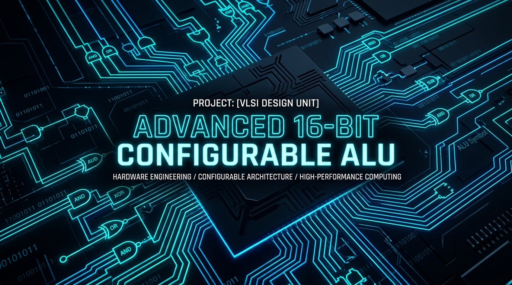
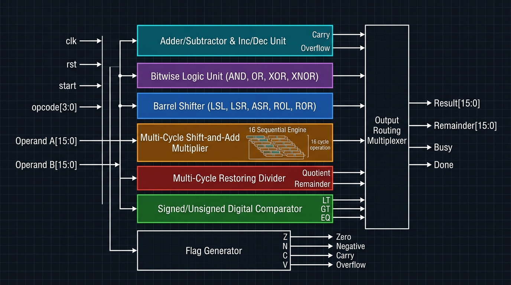
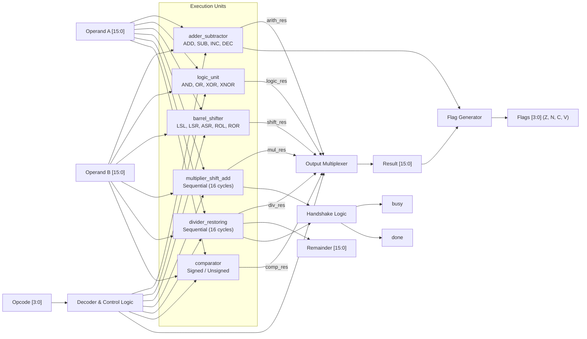
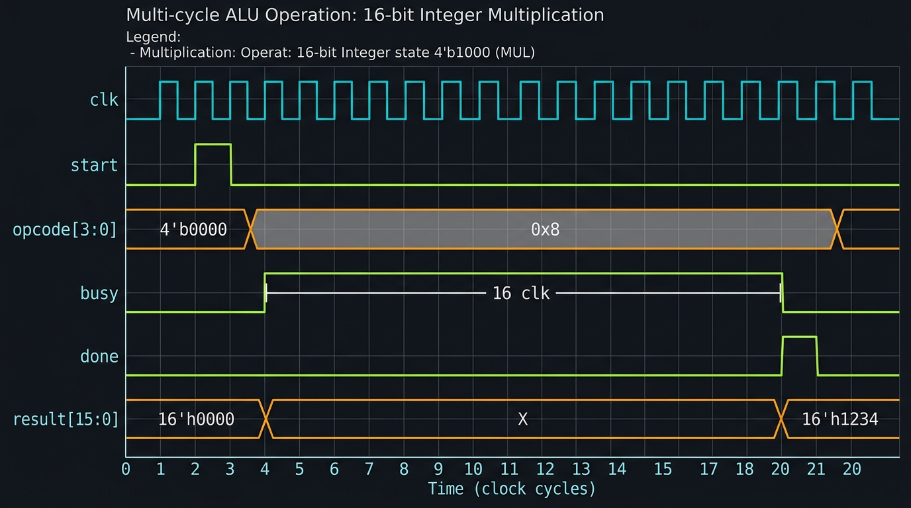

# Advanced 16-Bit Configurable ALU

<p align="center">
  
</p>

A parameterizable 16-bit Arithmetic Logic Unit (ALU) designed in Verilog-2001. The architecture combines single-cycle combinational units (arithmetic, bitwise logic, barrel shifter, and magnitude comparator) with dedicated 16-cycle iterative engines for multiplication and restoring division.

---

## Repository Structure

```plaintext
Advanced_alu/
├── assets/
│   ├── banner.png             # Project banner
│   ├── block_diagram.png      # Hardware microarchitecture block diagram
│   └── timing_diagram.png     # Multi-cycle handshake timing chart
├── adder_subtractor.v         # Unified ADD/SUB/INC/DEC unit with carry & overflow
├── logic_unit.v               # 8-function bitwise combinational logic unit
├── barrel_shifter.v           # Multi-mode parameterizable barrel shifter
├── multiplier_shift_add.v     # 16-cycle shift-and-add sequential multiplier
├── divider_restoring.v        # 16-cycle restoring integer division engine
├── comparator.v               # Signed & unsigned 3-bit magnitude comparator
├── flag_generator.v           # Status flags generator (Zero, Negative, Carry, Overflow)
├── alu_top.v                  # Top-level integration, opcode decoding & output MUX
├── alu_tb.v                   # Complete verification testbench
├── alu_top.yosys_show.png     # Yosys RTL synthesis gate-level schematic
├── wave.vcd                   # Simulation waveform dump
└── README.md                  # Design documentation and usage guide
```

---

## Architecture & Block Diagram

The top-level module `alu_top` routes 16-bit inputs `A` and `B` across parallel execution units. A 4-bit `opcode` controls operation selection, output multiplexing, and handshaking logic.

<p align="center">
  
</p>



---

## Module Breakdown

### 1. Arithmetic Unit (`adder_subtractor.v`)
Performs addition, subtraction, increment, and decrement by steering operand `B` and setting `cin`:
- **ADD (`00`):** `B_int = B`, `cin = 0` -> `A + B`
- **SUB (`01`):** `B_int = ~B`, `cin = 1` -> `A + ~B + 1` (`A - B`)
- **INC (`10`):** `B_int = 0`, `cin = 1` -> `A + 0 + 1` (`A + 1`, operand `B` ignored)
- **DEC (`11`):** `B_int = {WIDTH{1'b1}}`, `cin = 0` -> `A + (-1)` (`A - 1`, operand `B` ignored)

Hardware carry is extracted with left-hand concatenation:
```verilog
assign {carry, result} = A + B_int + cin;
```
Signed overflow detection checks when both inputs share the same sign bit while the result sign bit differs:
```verilog
assign overflow = (A[WIDTH-1] == B_int[WIDTH-1]) && (result[WIDTH-1] != A[WIDTH-1]);
```

### 2. Logic Unit (`logic_unit.v`)
Pure combinational module implementing 8 bitwise operations: `AND`, `OR`, `XOR`, `XNOR`, `NAND`, `NOR`, `NOT`, and `PASS`. Computes within a single gate propagation delay.

### 3. Barrel Shifter (`barrel_shifter.v`)
Performs multi-bit shifts and rotations in a single clock cycle using the lower 4 bits of `B` (`B[3:0]` for 16-bit):
- Logical Shift Left (`LSL`)
- Logical Shift Right (`LSR`)
- Arithmetic Shift Right (`ASR` — preserves sign bit)
- Rotate Left (`ROL`) & Rotate Right (`ROR`)

### 4. Sequential Multiplier (`multiplier_shift_add.v`)
An iterative shift-and-add hardware multiplier:
- Triggered by a 1-cycle `start` pulse when `opcode == 4'b1000`.
- Multiplies operands across 16 clock cycles.
- Asserts `busy = 1` during computation and drives `done = 1` for 1 cycle when the final product is ready.

### 5. Sequential Divider (`divider_restoring.v`)
Implements the restoring division algorithm to compute integer quotient and remainder:
- Initializes dividend into internal register and resets remainder.
- Shifts remainder and quotient, subtracts divisor, and restores remainder when negative.
- Completes in 16 clock cycles with `busy` and `done` handshaking signals.

### 6. Digital Comparator (`comparator.v`)
Compares inputs `A` and `B` and generates a 3-bit status vector:
- `cmp[2]` = Less Than (`LT`)
- `cmp[1]` = Greater Than (`GT`)
- `cmp[0]` = Equal (`EQ`)

Controlled by `opcode[0]`: evaluates as unsigned when `0`, and signed (`$signed(A)` vs `$signed(B)`) when `1`.

### 7. Flag Generator (`flag_generator.v`)
Generates 4 processor condition flags:
- **Z (Zero):** Set when `result == 0`.
- **N (Negative):** Set when MSB (`result[WIDTH-1]`) is `1`.
- **C (Carry):** Unsigned carry-out from arithmetic operations (0 for non-arithmetic ops).
- **V (Overflow):** Signed two's complement overflow from arithmetic operations.

---

## Instruction Set & Opcode Table

| Opcode `[3:0]` | Mnemonic | Category | Latency | Operation |
| :---: | :---: | :---: | :---: | :--- |
| `0000` (`0x0`) | **ADD** | Arithmetic | 1 cycle | `result = A + B` (Carry & Overflow updated) |
| `0001` (`0x1`) | **SUB** | Arithmetic | 1 cycle | `result = A - B` (Borrow & Overflow updated) |
| `0010` (`0x2`) | **INC** | Arithmetic | 1 cycle | `result = A + 1` |
| `0011` (`0x3`) | **DEC** | Arithmetic | 1 cycle | `result = A - 1` |
| `0100` (`0x4`) | **AND** | Logic | 1 cycle | `result = A & B` |
| `0101` (`0x5`) | **OR** | Logic | 1 cycle | `result = A \| B` |
| `0110` (`0x6`) | **XOR** | Logic | 1 cycle | `result = A ^ B` |
| `0111` (`0x7`) | **XNOR** | Logic | 1 cycle | `result = ~(A ^ B)` |
| `1000` (`0x8`) | **MUL** | Sequential | 16 cycles | `result = (A * B)[15:0]` |
| `1001` (`0x9`) | **DIV** | Sequential | 16 cycles | `result = A / B`, `remainder = A % B` |
| `1010` (`0xA`) | **CMP_U** | Compare | 1 cycle | Unsigned compare: `{13'b0, LT, GT, EQ}` |
| `1011` (`0xB`) | **CMP_S** | Compare | 1 cycle | Signed compare: `{13'b0, LT, GT, EQ}` |
| `1100` (`0xC`) | **LSL** | Shift | 1 cycle | `result = A << B[3:0]` |
| `1101` (`0xD`) | **LSR** | Shift | 1 cycle | `result = A >> B[3:0]` |

---

## Multi-Cycle Timing & Handshake Protocol

- **Single-Cycle Operations:** `done` remains continuously asserted (`1'b1`), and outputs update synchronously with input changes.
- **Multi-Cycle Operations (MUL / DIV):**
  1. Present the target `opcode` and input operands on `A` and `B`.
  2. Pulse `start` high for 1 clock cycle.
  3. `busy` asserts for 16 clock cycles while computation progresses.
  4. `busy` deasserts and `done` pulses high for 1 cycle when `result` (and `remainder`) is stable.

<p align="center">
  
</p>

---

## RTL Gate-Level Schematic

Synthesized netlist generated using Yosys Open Synthesis Suite:

<p align="center">
  
</p>

---

## Simulation & Verification

The testbench (`alu_tb.v`) exercises each opcode, verifies multi-cycle handshaking, and dumps waveforms to `wave.vcd`.

### Running with Icarus Verilog:
```bash
iverilog -o alu_sim *.v
vvp alu_sim
gtkwave wave.vcd
```

### Running with ModelSim / Questa:
```bash
vlib work
vlog -work work *.v
vsim -c -do "run -all; quit -f" work.alu_tb
```

### Testbench Console Output:
```text
ADD Result = 15
SUB Result = 7
LOGIC Result = 0000
SHIFT Result = 0004
COMPARE Result = 100
MUL Result = 18
DIV Result = 4 Remainder = 1
```

---

## Instantiation Example

```verilog
alu_top #(
    .WIDTH(16)
) u_alu (
    .clk       (clk),
    .rst       (rst),
    .start     (alu_start),
    .opcode    (alu_opcode[3:0]),
    .A         (operand_a),
    .B         (operand_b),
    .result    (alu_result),
    .remainder (alu_remainder),
    .busy      (alu_busy),
    .done      (alu_done),
    .flags     (alu_flags)     // {Z, N, C, V}
);
```

---

## Contributors

* **Abhay Tiwari** — [@abhayece](https://github.com/abhayece)
* **Ananya Inkane** — [@a1n6a5](https://github.com/a1n6a5) &bull; [ananyainkane@gmail.com](mailto:ananyainkane@gmail.com)

---

## License

This project is licensed under the MIT License.
