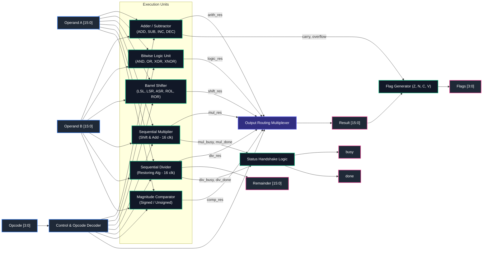

# ⚡ Advanced 16-bit Configurable ALU (Verilog RTL)

<p align="center">
  
</p>

<p align="center">
  
  
  
  
  
  
</p>

---

## 🚀 Welcome to the Project!

Ever wanted an ALU that goes beyond boring textbook adder-subtractors? This project is a **production-ready, parameterizable 16-bit Advanced Arithmetic Logic Unit (ALU)** written from scratch in clean, synthesizable Verilog-2001.

Whether you're building a custom 16-bit processor, a RISC-V compute stage, or exploring digital microarchitecture, this ALU has you covered. It neatly divides work between **lightning-fast single-cycle combinational operations** (arithmetic, bitwise logic, barrel shifting, magnitude comparisons) and **dedicated multi-cycle iterative hardware engines** (sequential shift-and-add multiplier and restoring divider).

---

## 🧠 Hardware Architecture & Block Diagram

Here’s the high-level bird’s-eye view of how data and control signals flow inside `alu_top`:

<p align="center">
  
</p>

### 🔍 Architectural Dataflow (Mermaid)



---

## 🛠️ Core Functional Blocks Deep Dive

Let's break down each submodule so you know exactly what is happening under the hood:

### 1. `adder_subtractor.v` (Smart Arithmetic Engine)
* **What it does:** Performs Addition (`ADD`), Subtraction (`SUB`), Increment (`INC`), and Decrement (`DEC`).
* **The Clever Part:** Instead of separate hardware for adders, subtractors, and incrementors, it uses a single adder with **2's complement operand steering**:
  * **SUB:** Inverts operand $B$ (`~B`) and sets carry-in `cin = 1` ($A + \sim B + 1 = A - B$).
  * **INC:** Forces $B$ to zero and sets `cin = 1` ($A + 0 + 1 = A + 1$). Completely ignores input $B$!
  * **DEC:** Uses all 1's (`{WIDTH{1'b1}}`, representing $-1$ in 2's complement) with `cin = 0` ($A + (-1) = A - 1$).
* **Flag generation:** Directly computes hardware Carry (`arith_c`) using LHS concatenation `{carry, result} = A + B_int + cin` and true Signed Overflow (`arith_v`) by comparing operand and result sign bits:
  $$\text{Overflow} = (A_{\text{sign}} == B\text{-int}_{\text{sign}}) \land (\text{Result}_{\text{sign}} \neq A_{\text{sign}})$$

### 2. `logic_unit.v` (Bitwise Logic Engine)
* **What it does:** Provides 8 fundamental bitwise operations: `AND`, `OR`, `XOR`, `XNOR`, `NAND`, `NOR`, `NOT A`, and `PASS A`.
* **Zero Delay:** Evaluates completely combinational in a single gate level.

### 3. `barrel_shifter.v` (Arbitrary Shift in One Cycle)
* **What it does:** Shifts or rotates data by any arbitrary amount specified in $B[\log_2(\text{WIDTH})-1:0]$ (lower 4 bits for 16-bit mode).
* **Supported Modes:**
  * Logical Shift Left (`LSL`)
  * Logical Shift Right (`LSR`)
  * Arithmetic Shift Right (`ASR` - sign bit preserving)
  * Rotate Left (`ROL`) & Rotate Right (`ROR`)
* Synthesizes smoothly into compact multiplexer trees.

### 4. `multiplier_shift_add.v` (16-Cycle Sequential Multiplier)
* **Why not a massive single-cycle `*`?** Single-cycle multipliers consume huge silicon area and ruin timing closure at high clock frequencies.
* **The Architecture:** Uses an iterative shift-and-add architecture:
  * Triggers on `start && (opcode == 4'b1000)`.
  * Computes the product across `WIDTH` (16) clock cycles.
  * Asserts `busy = 1` while crunching numbers.
  * Once the counter reaches `WIDTH - 1`, it pulses `done = 1` and latches the final result.

### 5. `divider_restoring.v` (16-Cycle Restoring Divider)
* **What it does:** Solves $A \div B$ in hardware, outputting **both** `quotient` and `remainder`.
* **The Algorithm:** Implements the classic **Restoring Division Algorithm**:
  * Shifts remainder left with the next MSB of the quotient.
  * Subtracts divisor from remainder.
  * If the result is negative, restores remainder and sets quotient bit to 0.
  * If positive, keeps remainder and sets quotient bit to 1.
  * Finishes cleanly in 16 clock cycles with handshaking signals (`busy`, `done`).

### 6. `comparator.v` (Signed & Unsigned Magnitude Comparator)
* **What it does:** Compares operands $A$ and $B$ and outputs a compact 3-bit status vector:
  * `cmp[2]` $\rightarrow$ Less Than (`LT`)
  * `cmp[1]` $\rightarrow$ Greater Than (`GT`)
  * `cmp[0]` $\rightarrow$ Equal (`EQ`)
* **Signed vs. Unsigned:** Controlled by `opcode[0]`. Setting it high treats operands as 2's complement signed integers (`$signed(A)` vs. `$signed(B)`).

### 7. `flag_generator.v` (Processor Status Flags)
Generates the standard CPU condition codes:
* **Z (Zero Flag):** Set when `result == 0`.
* **N (Negative Flag):** Set when MSB (`result[WIDTH-1]`) is `1` (negative in 2's complement).
* **C (Carry Flag):** Set on unsigned carry out from arithmetic operations.
* **V (Overflow Flag):** Set on signed two's complement arithmetic overflow.

---

## 📋 Instruction Set & Opcode Table

| Opcode `[3:0]` | Mnemonic | Class | Latency | Description | Formula / Output |
| :---: | :---: | :---: | :---: | :---: | :--- |
| `0000` (`0x0`) | **ADD** | Arithmetic | 1 cycle | Add with Carry | $\text{Result} = A + B$ |
| `0001` (`0x1`) | **SUB** | Arithmetic | 1 cycle | Subtract with Borrow | $\text{Result} = A - B$ |
| `0010` (`0x2`) | **INC** | Arithmetic | 1 cycle | Increment Operand A | $\text{Result} = A + 1$ |
| `0011` (`0x3`) | **DEC** | Arithmetic | 1 cycle | Decrement Operand A | $\text{Result} = A - 1$ |
| `0100` (`0x4`) | **AND** | Bitwise Logic | 1 cycle | Bitwise Logical AND | $\text{Result} = A \ \& \ B$ |
| `0101` (`0x5`) | **OR** | Bitwise Logic | 1 cycle | Bitwise Logical OR | $\text{Result} = A \ \| \ B$ |
| `0110` (`0x6`) | **XOR** | Bitwise Logic | 1 cycle | Bitwise Logical XOR | $\text{Result} = A \ \oplus \ B$ |
| `0111` (`0x7`) | **XNOR** | Bitwise Logic | 1 cycle | Bitwise Logical Equivalence | $\text{Result} = \sim(A \ \oplus \ B)$ |
| `1000` (`0x8`) | **MUL** | Sequential | 16 cycles | Shift-and-Add Unsigned Multiply | $\text{Result} = (A \times B)[15:0]$ |
| `1001` (`0x9`) | **DIV** | Sequential | 16 cycles | Restoring Division Engine | $\text{Result} = A / B$, $\text{Rem} = A \% B$ |
| `1010` (`0xA`) | **CMP_U** | Comparison | 1 cycle | Unsigned Magnitude Compare | $\text{Result} = \{13\text{'b0}, \text{LT}, \text{GT}, \text{EQ}\}$ |
| `1011` (`0xB`) | **CMP_S** | Comparison | 1 cycle | Signed Magnitude Compare | $\text{Result} = \{13\text{'b0}, \text{LT}, \text{GT}, \text{EQ}\}$ |
| `1100` (`0xC`) | **LSL** | Shift | 1 cycle | Logical Shift Left | $\text{Result} = A \ll B[3:0]$ |
| `1101` (`0xD`) | **LSR** | Shift | 1 cycle | Logical Shift Right | $\text{Result} = A \gg B[3:0]$ |

---

## ⏱️ Handshake Protocol & Multi-Cycle Timing

For single-cycle instructions (`ADD`, `SUB`, `AND`, `OR`, `CMP`, etc.), `done` remains permanently asserted (`1'b1`) and outputs update instantaneously upon input changes.

For heavy multi-cycle operations (`MUL` and `DIV`):
1. Assert the desired `opcode` (`4'b1000` or `4'b1001`) with operands on $A$ and $B$.
2. Pulse `start` high for **1 clock cycle**.
3. The ALU asserts `busy = 1` while processing across 16 clock cycles.
4. When finished, `busy` drops to `0`, and `done` pulses high for 1 cycle with the valid `result` (and `remainder` if DIV).

<p align="center">
  
</p>

---

## 🔬 Gate-Level Synthesized Schematic

Synthesized netlist generated using **Yosys Open Synthesis Suite**:

<p align="center">
  
</p>

*The schematic demonstrates parallel execution unit instantiations with multiplexer trees converging into the primary result bus and flag generator.*

---

## 💻 Simulation & Verification

The project includes a self-checking testbench (`alu_tb.v`) verifying every operation, including multi-cycle multiplier/divider handshaking and waveform dump.

### Running with Icarus Verilog (`iverilog`) & GTKWave:
```bash
# Compile design and testbench
iverilog -o alu_sim *.v

# Run the simulation (dumps wave.vcd)
vvp alu_sim

# View waveforms
gtkwave wave.vcd
```

### Running with ModelSim / Questa Intel FPGA Edition:
```bash
# Create working library
vlib work

# Compile all Verilog files
vlog -work work *.v

# Launch CLI simulation
vsim -c -do "run -all; quit -f" work.alu_tb
```

### Sample Simulation Output:
```text
ADD Result = 15
SUB Result = 7
LOGIC Result = 0000
SHIFT Result = 0004
COMPARE Result = 100 (A < B)
MUL Result = 18
DIV Result = 4 Remainder = 1
```

---

## 📂 Repository Structure

```plaintext
Advanced_alu/
├── assets/
│   ├── banner.png             # Modern hero project banner
│   ├── block_diagram.png      # High-res microarchitecture block diagram
│   └── timing_diagram.png     # Multi-cycle handshake timing chart
├── adder_subtractor.v         # Unified ADD/SUB/INC/DEC unit with carry & overflow
├── logic_unit.v               # 8-function bitwise combinational logic unit
├── barrel_shifter.v           # Multi-mode parameterizable barrel shifter
├── multiplier_shift_add.v     # 16-cycle shift-and-add sequential multiplier
├── divider_restoring.v        # 16-cycle restoring integer division engine
├── comparator.v               # Signed & unsigned 3-bit magnitude comparator
├── flag_generator.v           # Zero, Negative, Carry, Overflow flag generator
├── alu_top.v                  # Top-level integration, control logic & output MUX
├── alu_tb.v                   # Complete verification testbench
├── alu_top.yosys_show.png     # Yosys RTL synthesis gate-level schematic
├── wave.vcd                   # Simulation waveform dump
└── README.md                  # Detailed documentation & hardware guide
```

---

## 🔌 How to Instantiate in Your Project

Dropping this ALU into your custom processor or SoC pipeline is super straightforward:

```verilog
wire [15:0] alu_result;
wire [15:0] alu_remainder;
wire        alu_busy;
wire        alu_done;
wire [3:0]  alu_flags; // {Z, N, C, V}

alu_top #(
    .WIDTH(16)
) u_cpu_alu (
    .clk       (clk),
    .rst       (rst),
    .start     (alu_start_strobe),
    .opcode    (instruction_opcode[3:0]),
    .A         (rs1_data),
    .B         (rs2_data),
    .result    (alu_result),
    .remainder (alu_remainder),
    .busy      (alu_busy),
    .done      (alu_done),
    .flags     (alu_flags)
);
```

---

## 👨‍💻 Author

* **Abhay Tiwari** - [@abhayece](https://github.com/abhayece)
* Focus: VLSI Design, Digital System Architecture, FPGA & ASIC Engineering

---

## 📜 License

This project is licensed under the **MIT License** — feel free to use, modify, and integrate it into your own academic, personal, or commercial chips!
